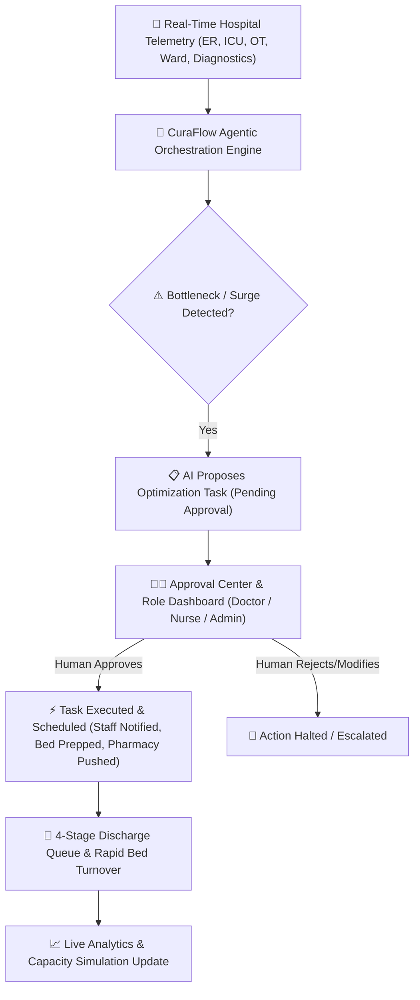

# 🏥 CuraFlow — Hospital AI Orchestration Platform
## Jury Presentation & Demonstration Guide

---

## 🎯 1. Executive Summary & Problem Statement (The 60-Second Elevator Pitch)

### **The Problem:**
Hospitals worldwide suffer from **severe operational friction**:
- **ER Overcrowding & Long Wait Times:** Non-critical patients clog triage while critical emergency patients face delays.
- **ICU & Ward Bed Bottlenecks:** Recovering ICU patients stay longer than necessary because ward beds aren't ready, blocking incoming emergency admissions.
- **Delayed Discharges:** Patients ready to go home spend 4–6 extra hours waiting for pharmacy clearance or billing settlement, stalling bed turnover.
- **Administrative Fatigue:** Clinicians waste hours manually calling departments to coordinate transfers, beds, and approvals.

### **The Solution — CuraFlow:**
**CuraFlow** is an **Agentic AI Hospital Orchestration Platform** that acts as the "Air Traffic Controller" for hospitals. It continuously monitors patient flow across all 5 key departments (*ER, Diagnostics, Operating Rooms, ICU, Wards*), predicts operational bottlenecks before they happen, and coordinates specialized AI agents to solve them—**always with Human-in-the-Loop (HITL) approval for medical safety.**

---

## 🏗️ 2. Core Architecture & Key Pillars

### **The 5 Pillars of CuraFlow:**
1. **Real-time Flow Analytics:** Continuous telemetry across ER Triage, Diagnostics (CT/MRI), OT, ICU, and Ward beds.
2. **Multi-Agent Orchestration:** Autonomous agents specialized in Triage Diversion, ICU Step-down, OT Scheduling, and Discharge Acceleration.
3. **Human-in-the-Loop (HITL) Safety:** AI *never* acts autonomously on medical decisions. Every recommendation generates a pending task requiring approval from the concerned doctor or nurse.
4. **Specialization-Based Role Filtering:** Doctors and Nurses see filtered, clutter-free dashboards tailored specifically to their discipline (e.g., Cardiology, ER, ICU, Orthopedics).
5. **4-Stage Discharge & Turnover Acceleration:** Streamlines *Clinical Clearance ➔ Pharmacy ➔ Billing ➔ Bed Release*, automatically triggering housekeeping the moment a patient exits.

---

## 🔄 3. End-to-End System Workflow

| Step | Stage | What System Does | Who Is Involved |
| :--- | :--- | :--- | :--- |
| **1** | **Surge Detection** | AI monitors live occupancy. E.g., ER demand hits 85% or ICU hits 92%. | Autonomous AI Agents |
| **2** | **Recommendation & HITL Task Creation** | AI generates a targeted resolution (e.g. *"Transfer stable ICU patient Eleanor Vance to Cardiology Ward 4B"*). Status set to `PENDING_APPROVAL`. | Agent System |
| **3** | **Human Review** | Task appears in the **Approval Center** and on the **Cardiology Doctor Dashboard**. | Dr. Robert Chen (Cardiologist) |
| **4** | **Approval & Task Scheduling** | Dr. Chen clicks **Approve**. Task status transitions from `PENDING_APPROVAL` ➔ `SCHEDULED`. Staff assigned automatically. | Doctor & Assigned Nurse |
| **5** | **4-Stage Discharge Acceleration** | Patient moves through Discharge Queue: *1. Clinical Clearance* ➔ *2. Pharmacy Clearance* ➔ *3. Billing Settlement* ➔ *4. Exit & Bed Release*. | Pharmacy, Billing, Housekeeping |
| **6** | **Automated Bed Turnover** | On final exit, bed status flips to `Cleaning Required`. Housekeeping is dispatched. Bed becomes `Available` in under 15 minutes. | Housekeeping Staff |

---

## 🌟 4. Real-World Walkthrough Example (For Jury Demonstration)

### **Scenario: Resolving an ICU Saturation Crisis via Cardiology Discharge**

> **Background:** The hospital's ICU is at **92% capacity** (13 of 14 beds occupied). An emergency cardiac arrest patient is arriving by ambulance in 20 minutes.

#### **Step 1: AI Surge Detection & Recommendation**
- The **ICU Agent** detects that Bed 4 is occupied by **Eleanor Vance (MRN-10928)**, a post-angioplasty patient who has been stable for 18 hours.
- The AI creates a proposed action: *"Accelerate Step-Down Transfer of Eleanor Vance to Cardiology Ward 4B (BED-402) & Initiate Discharge Preparation."*
- State: `PENDING_APPROVAL` (no changes are made until human verifies).

#### **Step 2: Doctor Approval (HITL)**
- **Dr. Robert Chen** logs into his **Cardiology Doctor Dashboard**.
- Because of **Specialization Filtering**, Dr. Chen only sees Cardiology patients and pending Cardiology tasks.
- He reviews Eleanor’s vitals (BP 122/78, Heart Rate 72 bpm, stable EKG).
- Dr. Chen clicks **"Approve Transfer & Discharge Protocol"**.
- System logs: `Approved by Dr. Robert Chen at 11:07 AM` ➔ Task moves to `SCHEDULED`.

#### **Step 3: Discharge Queue Acceleration**
- Eleanor is moved to Ward Bed 402, freeing up the ICU bed **immediately** for the incoming emergency!
- Eleanor enters the **Discharge Queue Management System**:
  - **Stage 1 (Clinical Clearance):** Completed by Dr. Chen (`✓ Clinical Cleared`).
  - **Stage 2 (Pharmacy & Meds):** AI flags a bottleneck: *"Take-home blood thinner (Ticagrelor) pending pharmacy verification (>30 mins delay)"*. Nurse Joy clicks **"Clear Pharmacy Meds"**.
  - **Stage 3 (Billing Settlement):** Insurance co-pay confirmed electronically (`✓ Billing Cleared`).
  - **Stage 4 (Exit & Bed Release):** Patient departs. Nurse clicks **"Complete Discharge & Release Bed"**.

#### **Step 4: Automated Bed Turnover**
- Ward Bed 402 is instantly flagged as `Cleaning Required`.
- Housekeeping staff receive a mobile notification.
- Turnaround time is reduced from **4.5 hours down to 42 minutes**.

---

## 🎤 5. Key Questions the Jury Will Ask & How to Answer

### **Q1: "Isn't it dangerous to let AI manage patient transfers and discharges?"**
> **Answer:** "CuraFlow strictly enforces **Human-in-the-Loop (HITL) governance**. The AI never makes medical decisions independently. It acts as an intelligent decision-support engine—identifying bottlenecks, calculating risk scores, and staging action items in a `PENDING_APPROVAL` queue. Nothing executes without an explicit digital signature from the responsible physician or charge nurse."

### **Q2: "How does this prevent doctor burnout and information overload?"**
> **Answer:** "Instead of overwhelming clinicians with raw hospital data, CuraFlow features **Specialization-Based Role Access**. A Cardiologist sees only cardiac patients, relevant vitals, and Cardiology approvals. An ER Physician sees triage scores and diversion protocols. This eliminates clutter and reduces cognitive load."

### **Q3: "How does CuraFlow handle discharge delays?"**
> **Answer:** "Discharges stall primarily at pharmacy verification or billing clearance. CuraFlow tracks discharges through a 4-stage pipeline (*Clinical ➔ Pharmacy ➔ Billing ➔ Exit*). If a stage exceeds 30 minutes, the system flags a **Discharge Bottleneck** with a single-click resolution button for staff to clear the stall."

### **Q4: "Can this system integrate with existing hospital EMRs like Epic or Cerner?"**
> **Answer:** "Yes! CuraFlow is built on standard REST/FHIR APIs and FastAPI backend architecture. It ingests telemetry data from existing Electronic Medical Records (EMRs) and bed management systems in real-time."

---

## 💻 6. Quick Demo Checklist for Live Presentation

1. **Dashboard Overview (`/`):**
   - Show the **Patient Flow Analysis** page: Highlight live metrics across ER, Diagnostics, OT, ICU, and Ward.
2. **Approval Center / Staff Dashboard:**
   - Switch to **Doctor View (Cardiology)**: Show how non-relevant data is filtered out.
   - Show a task in `PENDING_APPROVAL` status and click **Approve**.
3. **Discharge Queue Management (`Discharge Queue` sidebar link):**
   - Show Eleanor Vance in Stage 2 (Pharmacy Pending).
   - Click **Clear Pharmacy Meds** ➔ show progression to Billing ➔ Complete Discharge.
4. **Capacity Simulation:**
   - Show how adjusting surge sliders predicts bed saturation in real-time.

---
*Created for CuraFlow Jury Defense Presentation*
